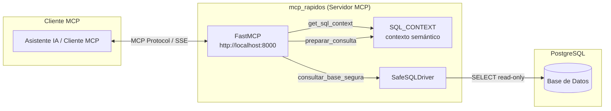
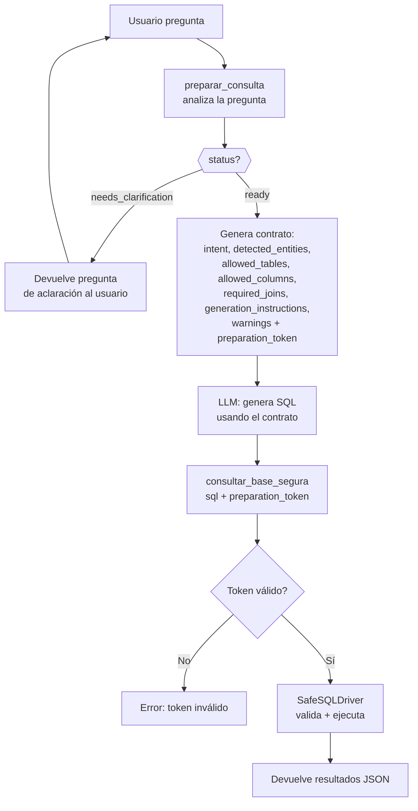
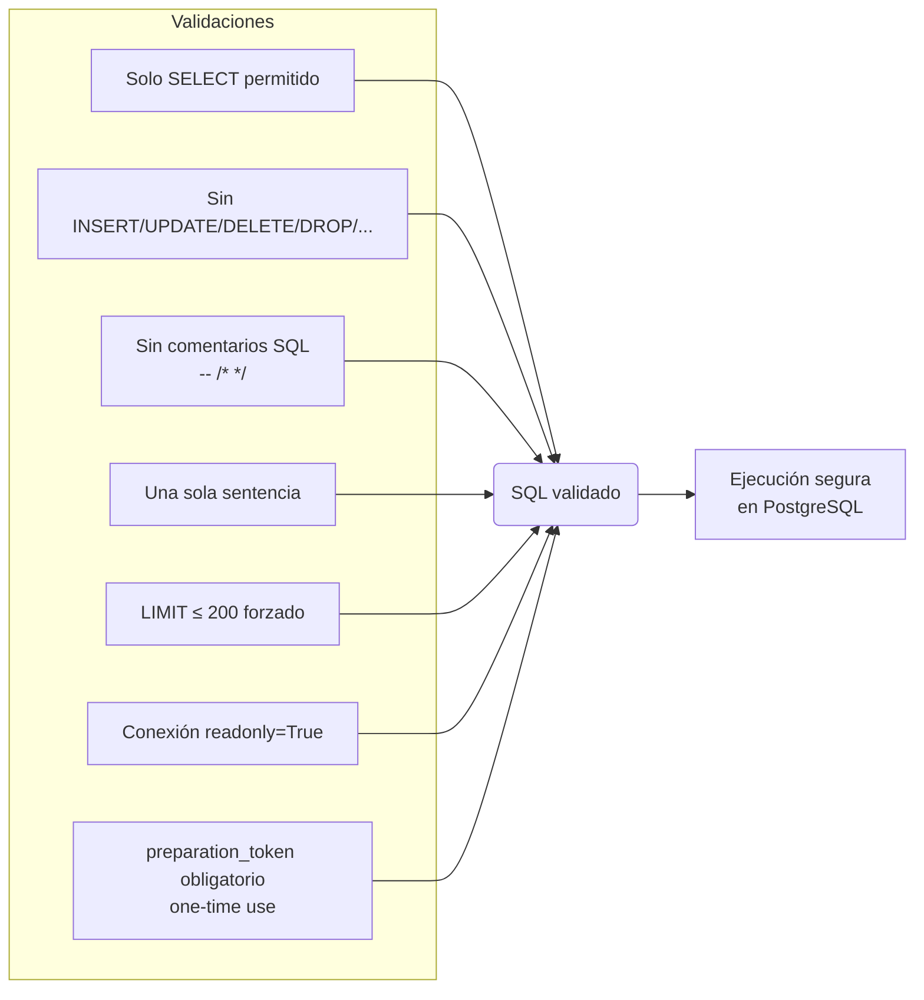

# mcp_rapidos

Servidor **MCP (Model Context Protocol)** para consultas semánticas **solo lectura** sobre una base de datos **PostgreSQL** de publicaciones académicas ICT. El servidor expone un contexto enriquecido (`SQL_CONTEXT`) con sinónimos, reglas de negocio y esquema, más herramientas para preparar y ejecutar consultas SQL de forma segura y guiada.

---

## Stack tecnológico

| Componente | Tecnología | Versión | Propósito |
|---|---|---|---|
| Lenguaje | Python | **3.14.3** | Entorno de ejecución |
| Framework MCP | `fastmcp` | **3.2.4** | Creación y exposición de tools MCP |
| Protocolo MCP | `mcp` | **1.27.0** | Core del Model Context Protocol |
| Base de datos | PostgreSQL | — | Motor de base de datos relacional |
| Conector DB | `psycopg2` / `psycopg2-binary` | **2.9.11 / 2.9.12** | Conexión a PostgreSQL |
| Variables de entorno | `python-dotenv` | **1.2.2** | Carga de configuración desde `.env` |
| Servidor ASGI | `uvicorn` | **0.44.0** | Servidor HTTP para el transporte MCP |
| Framework web | `starlette` | **1.0.0** | Soporte de rutas y middleware HTTP |
| SSE | `sse-starlette` | **3.3.4** | Server-Sent Events para transporte MCP |
| Validación | `pydantic` | **2.13.2** | Validación de datos y modelos (ej. `ConsultaPreparada`) |

---

## Estructura del proyecto

```
mcp_rapidos/
├── script.py              # Punto de entrada — levanta el servidor MCP y expone tools
├── SafeSQLDriver.py       # Driver seguro de base de datos (validación, solo lectura)
├── .env                   # Credenciales de conexión a PostgreSQL
├── pyvenv.cfg             # Configuración del entorno virtual (Python 3.14.3)
├── .gitignore
├── bin/                   # Ejecutables del virtualenv
├── lib/                   # Dependencias instaladas (site-packages)
├── include/               # Cabeceras del virtualenv
├── lib64/                 # Symlink a lib/
└── __pycache__/           # Cache de bytecode compilado
```

---

## Instalación y configuración

### Requisitos previos

- Python 3.14+
- PostgreSQL accesible
- Entorno virtual (incluido en el repositorio)

### Configuración de base de datos

Crear un archivo `.env` en la raíz (o modificar el existente):

```env
DB_NAME=ict-mcp
DB_USER=mcp_readonly
DB_PASSWORD=tu_contraseña
DB_HOST=localhost
DB_PORT=5432
```

> **Nota de seguridad:** Se recomienda crear un usuario de PostgreSQL con permisos **exclusivamente de lectura** (`SELECT`) para usar con este servidor.

### Ejecución

```bash
python script.py
```

El servidor arrancará en `http://localhost:8000` usando transporte HTTP con SSE.

---

## Diagramas de arquitectura

### Arquitectura general



### Flujo de ejecución — pregunta del usuario → resultado



### Estructura del `SQL_CONTEXT`

```mermaid
flowchart TD
    subgraph SQL_CONTEXT
        AR[agent_rules]
        DN[database_notes]
        DS[database_schema]
        ER[extra_rules]
    end

    subgraph agent_rules
        MF[mandatory_flow<br/>orden obligatorio de pasos]
        SR[sql_rules<br/>búsquedas, acentos, DISTINCT,<br/>unaccent prohibido]
    end

    subgraph database_notes
        N1[Base no normalizada]
        N2[Variaciones de nombre<br/>Sandra Casas ≠ Sandra Isabel Casas]
        N3[Duplicados con/sin acentos]
    end

    subgraph database_schema
        T1[autor]
        T2[ict]
        T3[palabra_clave]
        T4[ict_autor]
        T5[ict_palabra]
        R[relaciones many-to-many]
    end

    subgraph extra_rules
      TS[table_synonyms]
      CS[column_synonyms]
      DV[data_values]
      NR[normalization_rules]
      AM[ambiguity_rules]
    end

    AR --> MF
    AR --> SR
    DS --> T1 & T2 & T3 & T4 & T5 & R
    DN --> N1 & N2 & N3
    ER --> TS & CS & DV & NR & AM
```



### Seguridad — SafeSQLDriver



---

## Tools expuestas

### `preparar_consulta(pregunta: str) -> ConsultaPreparada`

Analiza la pregunta del usuario y devuelve un contrato estructurado que el LLM debe usar para generar SQL. **No genera SQL por sí misma.**

**Parámetros:**

| Nombre | Tipo | Descripción |
|---|---|---|
| `pregunta` | `str` | Pregunta textual del usuario (ej. "publicaciones de José Pérez sobre inteligencia artificial") |

**Respuesta (`ConsultaPreparada`):**

```json
{
  "status": "ready",
  "original_question": "publicaciones de José Pérez sobre inteligencia artificial",
  "reason": "No se detectaron ambigüedades bloqueantes.",
  "preparation_token": "uuid-generado",
  "intent": "publication_search_by_keyword_or_topic",
  "detected_entities": {
    "quoted_terms": [],
    "filters": {}
  },
  "allowed_tables": ["autor", "ict", "ict_autor", "ict_palabra", "palabra_clave"],
  "allowed_columns": [
    "autor.id_autor", "autor.nombre",
    "ict.id_ict", "ict.titulo", "ict.resumen", "ict.tipo",
    "ict.idioma", "ict.disciplinas", "ict.estado", "ict.doi",
    "ict.fecha_envio", "ict.volumen", "ict.numero",
    "ict.pagina_inicio", "ict.pagina_fin",
    "ict_autor.id_ict", "ict_autor.id_autor",
    "palabra_clave.id_palabra", "palabra_clave.palabra",
    "ict_palabra.id_ict", "ict_palabra.id_palabra"
  ],
  "required_joins": [
    "ict.id_ict = ict_autor.id_ict",
    "autor.id_autor = ict_autor.id_autor",
    "ict.id_ict = ict_palabra.id_ict",
    "palabra_clave.id_palabra = ict_palabra.id_palabra"
  ],
  "sql_constraints": {
    "only_select": true,
    "limit_required": true,
    "default_limit": 25,
    "max_limit": 100,
    "no_select_star": true,
    "text_search_operator": "ILIKE",
    "forbidden_functions": ["unaccent"],
    "forbidden_statements": ["INSERT", "UPDATE", "DELETE", "DROP", "ALTER", "CREATE", "TRUNCATE", "GRANT", "REVOKE"],
    "must_use_preparation_token": true
  },
  "generation_instructions": [
    "Generar una única consulta SQL.",
    "La consulta debe ser solamente SELECT.",
    "Usar únicamente allowed_tables, allowed_columns y required_joins.",
    "No usar SELECT *.",
    "Agregar LIMIT si el usuario no pidió explícitamente todos los resultados.",
    "Usar ILIKE para búsquedas textuales.",
    "No usar unaccent().",
    "Cuando la pregunta pida un máximo, mínimo o ranking (ej: 'autor con más publicaciones'), y existan empates en los valores agregados, mostrar TODOS los resultados empatados. No limitar a uno solo.",
    "Si hay joins con autor o palabra_clave, usar DISTINCT sobre ict.id_ict cuando se listen publicaciones.",
    "Después de generar SQL, llamar a consultar_base_segura con este preparation_token."
  ],
  "warnings": [
    "La base no está normalizada.",
    "Puede haber autores, palabras clave o publicaciones duplicadas.",
    "En los datos de la tabla autor, es posible que una misma persona aparezca bajo múltiples variaciones de nombre debido a inconsistencias en la base de datos.",
    "Los nombres de autor pueden tener diferencias de acentos (ej: 'José' y 'Jose'). Asegurar que la búsqueda ILIKE cubra variantes acentuadas y no acentuadas de cada palabra.",
    "Usar DISTINCT si hay joins muchos-a-muchos o riesgo de duplicados.",
    "No asumir que nombres iguales representan una única entidad.",
    "No usar columnas ni tablas fuera del contrato devuelto por preparar_consulta."
  ]
}
```

**Posibles estados (`status`):**

| Status | Significado |
|---|---|
| `ready` | La pregunta está clara. El LLM debe generar SQL usando el contrato. |
| `needs_clarification` | Hay ambigüedad. El LLM debe preguntar al usuario según `question`. |
| `error` | La pregunta está vacía o es inválida. |

### `consultar_base_segura(sql: str, preparation_token: str) -> dict`

Ejecuta una consulta SQL de solo lectura, validando que el `preparation_token` haya sido generado previamente por `preparar_consulta` y que no haya sido usado aún (one-time use).

**Parámetros:**

| Nombre | Tipo | Descripción |
|---|---|---|
| `sql` | `str` | Consulta SQL generada por el LLM |
| `preparation_token` | `str` | Token devuelto por `preparar_consulta` |

**Validaciones aplicadas (SafeSQLDriver):**

- Solo `SELECT`
- Bloqueo de keywords: `INSERT`, `UPDATE`, `DELETE`, `DROP`, `ALTER`, `CREATE`, `TRUNCATE`, `GRANT`, `REVOKE`
- Máximo una sentencia
- Sin comentarios SQL (`--`, `/* */`)
- Sin caracteres nulos (`\x00`)
- LIMIT forzado (máx. 200 filas)
- Conexión `readonly`
- Token one-time: se invalida tras el primer uso

**Respuesta:**

```json
{
  "success": true,
  "sql": "SELECT DISTINCT ict.id_ict, ict.titulo FROM ict ... LIMIT 25",
  "row_count": 25,
  "rows": [
    { "id_ict": 1, "titulo": "..." }
  ]
}
```

### `get_sql_context() -> dict`

Devuelve el `SQL_CONTEXT` completo: sinónimos de tablas/columnas, reglas de joins, valores permitidos, reglas de normalización, reglas de ambigüedad y notas sobre la base de datos.

---

## Reglas del agente

El servidor expone un conjunto de reglas en `agent_rules` dentro del `SQL_CONTEXT` que el LLM debe cumplir estrictamente al generar consultas.

### Flujo obligatorio (`mandatory_flow`)

1. **No reescribir ni ampliar la pregunta del usuario original.** Siempre tenerla en cuenta. Cuando se responda una duda, añadirla a la pregunta original más la aclaración.
2. **Primero llamar a `preparar_consulta`** con la pregunta textual original del usuario.
3. Si `preparar_consulta` devuelve `status = needs_clarification`, hacer exactamente esa pregunta al usuario y no hacer nada más.
4. **No llamar a `consultar_base_segura`** hasta que `preparar_consulta` devuelva `status = ready`.
5. Si `preparar_consulta` devuelve `status = ready`, generar SQL usando **solamente** la pregunta original, `entities`, `filters`, `hints` y el `SQL_CONTEXT`.
6. **Después de generar SQL**, llamar a `consultar_base_segura` con el `preparation_token` devuelto.

### Reglas SQL (`sql_rules`)

| # | Regla | Detalle |
|---|---|---|
| 1 | Solo SELECT | Generar únicamente sentencias `SELECT`. |
| 2 | LIMIT por defecto | Siempre agregar `LIMIT` si el usuario no pide todos los resultados explícitamente. |
| 3 | Búsqueda inexacta (default) | Si el usuario busca nombres o frases **sin comillas dobles** (ej. `Sandra Casas`), separar las palabras y conectarlas con `AND`. Ej: `WHERE nombre ILIKE '%sandra%' AND nombre ILIKE '%casas%'`. Obligatorio para atrapar variantes como "Sandra Isabel Casas". |
| 4 | Búsqueda exacta (comillas) | Solo si el usuario encierra el término en **comillas dobles** (ej. `"Sandra Casas"`), asumir contigüidad. Ej: `WHERE nombre ILIKE '%sandra casas%'`. |
| 5 | No usar `unaccent()` | La función no existe en esta base de datos. |
| 6 | **Acentos (CRÍTICO)** | Para cada palabra en búsquedas textuales, generar condiciones ILIKE que cubran **forma acentuada y no acentuada**. Ej: para "José Pérez": `WHERE (nombre ILIKE '%jose%' OR nombre ILIKE '%josé%') AND (nombre ILIKE '%perez%' OR nombre ILIKE '%pérez%')`. Aplica a vocales con tilde (`á`, `é`, `í`, `ó`, `ú`) y a la `ñ`. |
| 7 | DISTINCT | Usar `DISTINCT` cuando haya riesgo de duplicados (joins muchos-a-muchos). |
| 8 | Unicidad | No asumir que nombres iguales representan la misma entidad. Una misma persona puede aparecer bajo múltiples variaciones de nombre. |

### Empates en rankings

Cuando la pregunta pida un **máximo, mínimo o ranking** (ej: "autor con más publicaciones", "artículo más reciente"), y existan **empates** en los valores agregados, mostrar **todos** los resultados empatados. No limitar a uno solo.

```sql
-- Ejemplo: si dos autores tienen 8 publicaciones cada uno, mostrar ambos
SELECT a.nombre, COUNT(ia.id_ict) AS total
FROM autor a
JOIN ict_autor ia ON a.id_autor = ia.id_autor
GROUP BY a.id_autor, a.nombre
ORDER BY total DESC
LIMIT 10;  -- incluye todos los empatados en el 1er puesto
```

### Notas sobre la base de datos (`database_notes`)

- La base **no está normalizada**.
- En la tabla `autor`, una misma persona puede aparecer bajo múltiples variaciones de nombre (ej: "Sandra Casas" y "Sandra Isabel Casas") con diferentes publicaciones.
- El usuario probablemente no conoce segundos nombres, temas exactos o disciplinas.
- Existen autores y palabras clave repetidas con diferencias de mayúsculas, **acentos**, abreviaturas o palabras faltantes.
- Puede haber registros duplicados.
- Ante ambigüedad, pedir aclaración antes de generar SQL.

---

## SafeSQLDriver — capa de seguridad

`SafeSQLDriver` (`SafeSQLDriver.py`) es el núcleo de seguridad del proyecto. Sus responsabilidades:

1. **Conexión segura** — Lee credenciales desde `.env` y abre conexiones vía `psycopg2`
2. **Validación estricta de SQL** — Solo `SELECT`, sin comentarios, sin múltiples sentencias
3. **Protección contra escritura** — Sesión `readonly=True` + bloqueo de keywords DML/DDL
4. **Límite de resultados** — `LIMIT 200` máximo aplicado automáticamente
5. **One-time token** — `consultar_base_segura` solo ejecuta si el `preparation_token` fue generado por `preparar_consulta` y no ha sido usado antes
6. **Uso de `RealDictCursor`** — Devuelve filas como diccionarios para facilitar el consumo JSON
