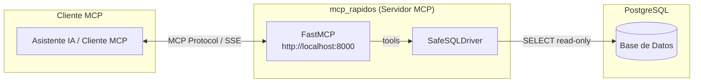
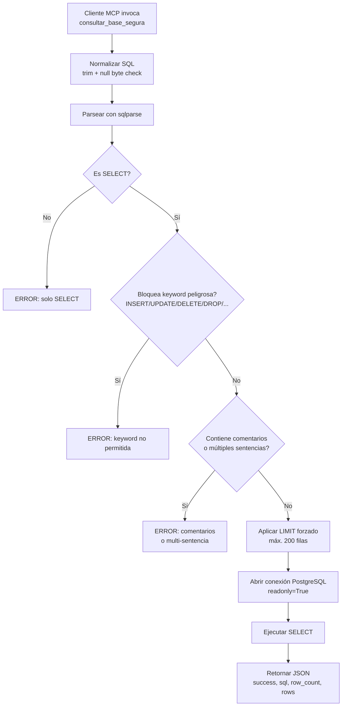
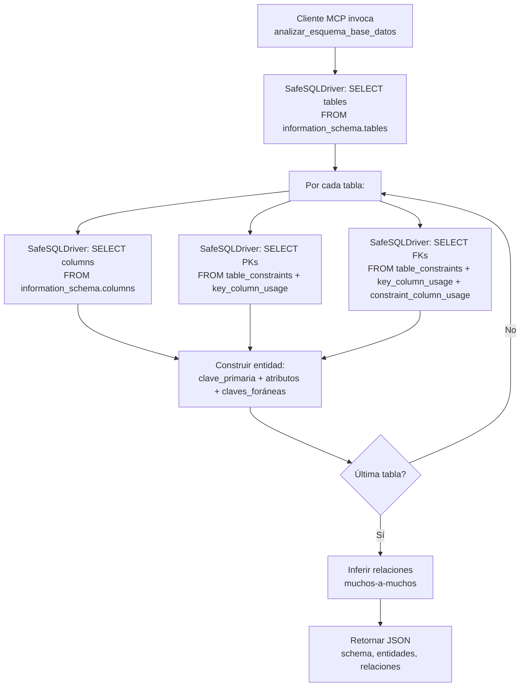
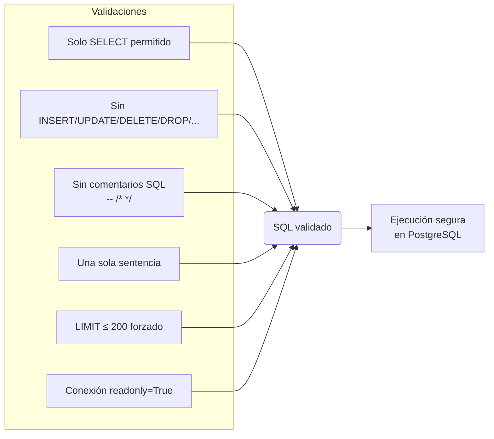

# mcp_rapidos

Servidor **MCP (Model Context Protocol)** para análisis seguro de esquemas y consultas **solo lectura** sobre bases de datos **PostgreSQL**. Expone herramientas (`tools`) que pueden ser consumidas por clientes MCP (asistentes de IA, CLIs, etc.).

---

## Stack tecnológico

| Componente | Tecnología | Versión | Propósito |
|---|---|---|---|
| Lenguaje | Python | **3.14.3** | Entorno de ejecución |
| Framework MCP | `fastmcp` | **3.2.4** | Creación y exposición de tools MCP |
| Protocolo MCP | `mcp` | **1.27.0** | Core del Model Context Protocol |
| Base de datos | PostgreSQL | — | Motor de base de datos relacional |
| Conector DB | `psycopg2` / `psycopg2-binary` | **2.9.11 / 2.9.12** | Conexión a PostgreSQL |
| Parser SQL | `sqlparse` | **0.5.5** | Parseo y validación de sentencias SQL |
| Variables de entorno | `python-dotenv` | **1.2.2** | Carga de configuración desde `.env` |
| Servidor ASGI | `uvicorn` | **0.44.0** | Servidor HTTP para el transporte MCP |
| Framework web | `starlette` | **1.0.0** | Soporte de rutas y middleware HTTP |
| SSE | `sse-starlette` | **3.3.4** | Server-Sent Events para transporte MCP |
| Validación | `pydantic` | **2.13.2** | Validación de datos y modelos |
| HTTP Client | `httpx` | **0.28.1** | Cliente HTTP para comunicaciones |
| Async runtime | `anyio` | **4.13.0** | Ejecución asíncrona |

---

## Estructura del proyecto

```
mcp_rapidos/
├── script.py              # Punto de entrada — levanta el servidor MCP y expone tools
├── SafeSQLDriver.py       # Driver seguro de base de datos (validación, solo lectura)
├── .env                   # Credenciales de conexión a PostgreSQL
├── pyvenv.cfg             # Configuración del entorno virtual (Python 3.14.3)
├── .gitignore
├── bin/                   # Ejecutables del virtualenv
├── lib/                   # Dependencias instaladas (site-packages)
├── include/               # Cabeceras del virtualenv
├── lib64/                 # Symlink a lib/
└── __pycache__/           # Cache de bytecode compilado
```

---

## Instalación y configuración

### Requisitos previos

- Python 3.14+
- PostgreSQL accesible
- Entorno virtual (incluido en el repositorio)

### Configuración de base de datos

Crear un archivo `.env` en la raíz (o modificar el existente):

```env
DB_NAME=ict-mcp
DB_USER=mcp_readonly
DB_PASSWORD=tu_contraseña
DB_HOST=localhost
DB_PORT=5432
```

> **Nota de seguridad:** Se recomienda crear un usuario de PostgreSQL con permisos **exclusivamente de lectura** (`SELECT`) para usar con este servidor.

### Ejecución

```bash
python script.py
```

El servidor arrancará en `http://localhost:8000` usando transporte HTTP con SSE.

---

## Diagramas de arquitectura

### Arquitectura general



### Flujo de ejecución — `consultar_base_segura()`



### Flujo de ejecución — `analizar_esquema_base_datos()`



### Seguridad — SafeSQLDriver



---

## Tools expuestas

### `analizar_esquema_base_datos`

Examina el esquema de una base de datos PostgreSQL y devuelve una estructura completa con entidades, atributos, claves primarias, claves foráneas y relaciones inferidas.

**Parámetros:**

| Nombre | Tipo | Default | Descripción |
|---|---|---|---|
| `schema` | `str` | `"public"` | Esquema de PostgreSQL a analizar |

**Respuesta (estructura):**

```json
{
  "schema": "public",
  "entidades": {
    "nombre_tabla": {
      "descripcion": "Tabla nombre_tabla.",
      "clave_primaria": "id",
      "atributos": {
        "id": {
          "tipo": "integer",
          "nullable": false,
          "default": "nextval(...)",
          "descripcion": "Identificador único del registro."
        },
        "titulo": {
          "tipo": "character varying(255)",
          "nullable": false,
          "default": null,
          "descripcion": "Título del registro.",
          "clave_foranea": {
            "tabla": "otra_tabla",
            "atributo": "id"
          }
        }
      }
    }
  },
  "relaciones": [
    {
      "tipo": "posible_muchos_a_muchos",
      "tabla_intermedia": "tabla_join",
      "desde": "tabla_a",
      "hacia": "tabla_b",
      "descripcion": "La tabla tabla_join parece representar una relación muchos a muchos."
    }
  ]
}
```

### `consultar_base_segura`

Ejecuta una consulta SQL de solo lectura con validaciones de seguridad.

**Parámetros:**

| Nombre | Tipo | Default | Descripción |
|---|---|---|---|
| `sql` | `str` | — | Consulta SQL (solo SELECT) |

**Validaciones aplicadas:**

- Solo se permite el statement type `SELECT`
- Bloqueo de keywords: `INSERT`, `UPDATE`, `DELETE`, `DROP`, `ALTER`, `CREATE`, `TRUNCATE`, `GRANT`, `REVOKE`, `MERGE`, `CALL`, `EXECUTE`, `COPY`, `VACUUM`, `ANALYZE`
- Máximo una sentencia por ejecución
- Sin comentarios SQL (`--`, `/* */`)
- Sin caracteres nulos (`\x00`)
- Se fuerza un `LIMIT 200` si no existe o si excede ese valor
- Conexión en modo `readonly` a nivel de sesión PostgreSQL

**Respuesta:**

```json
{
  "success": true,
  "sql": "SELECT * FROM tabla LIMIT 200",
  "row_count": 200,
  "rows": [ { "columna1": "valor1", "columna2": "valor2" } ]
}
```

---

## SafeSQLDriver — capa de seguridad

`SafeSQLDriver` (`SafeSQLDriver.py:10`) es el núcleo de seguridad del proyecto. Sus responsabilidades:

1. **Conexión segura** — Lee credenciales desde `.env` y abre conexiones vía `psycopg2`
2. **Validación estricta de SQL** — Solo `SELECT`, sin comentarios, sin múltiples sentencias
3. **Protección contra escritura** — Sesión `readonly=True` + bloqueo de keywords DML/DDL
4. **Límite de resultados** — `LIMIT 200` máximo aplicado automáticamente
5. **Uso de `RealDictCursor`** — Devuelve filas como diccionarios para facilitar el consumo JSON
